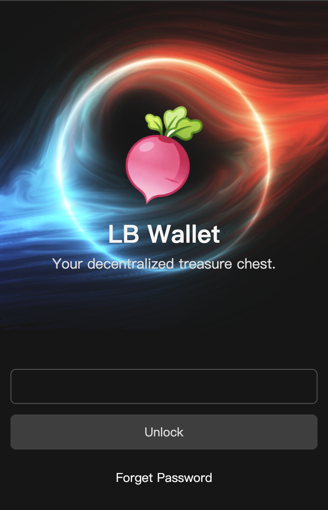

## Ethereum Wallet

This is an Ethereum wallet, hereinafter referred to as "this program." Most wallet apps nowadays have overly complex features, making them inconvenient to use. This program aims to deliver a simple and user-friendly experience.



## Dependencies

```shell
"@radix-ui/react-dialog": "^1.1.15",
"@radix-ui/react-dropdown-menu": "^2.1.16",
"@radix-ui/react-toggle-group": "^1.1.11",
"ethers": "^6.15.0",
"lottie-web": "^5.13.0",
"qrcode": "^1.5.4",
"react": "^19.1.0",
"react-dom": "^19.1.0",
"react-router": "^7.5.3",
"sonner": "^2.0.7"
```

## Why Choose This Program

1. **Security**: This program does not collect any data during operation. All network requests it makes originate from the network configurations in the settings center, giving you full control over them. Wallet creation can also be done completely offline, so you never have to worry about key leakage.

2. **Simplicity**: This program offers an intuitive and easy-to-navigate interface with clear, straightforward functional modules.

3. This program is fully compatible with MetaMask, allowing you to import your mnemonic phrase into either this program or MetaMask for use.

## Limitations

1. This program currently does not support NFTs or connecting to DApps.

2. Since the program uses interfaces sourced from https://chainlist.org, they may occasionally be unstable. However, you can easily switch them in the network settings at any time.
